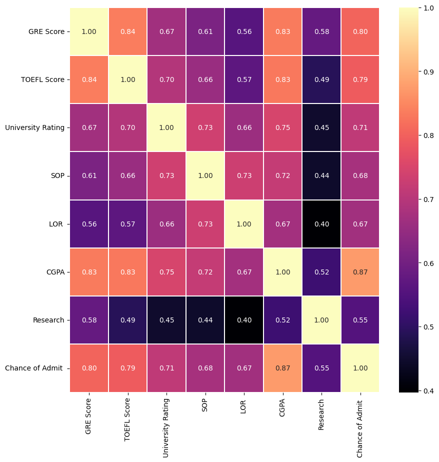

# Graduate Admissions Analysis: Predicting Success with EDA 🎓📈

This repository contains a comprehensive **Exploratory Data Analysis (EDA)** of the Graduate Admissions dataset. The project explores how academic factors like GRE scores, TOEFL scores, and CGPA influence the probability of admission.

## 🚀 Project Overview
The goal of this analysis is to identify key drivers for university admissions and validate data distributions using statistical methods.

### Key Insights:
* **Strongest Predictor:** CGPA shows the highest correlation (0.87) with the chance of admission.
* **Data Distribution:** GRE scores follow an approximately normal distribution, which validates the use of parametric statistical techniques.
* **Feature Relationships:** TOEFL scores and GRE scores are highly correlated, reflecting a consistent academic performance across standardized tests.

## 📊 Visualizations Included
* **Annotated Boxplots:** Detailed view of TOEFL score dispersion, highlighting medians and quartiles.
* **Correlation Heatmaps:** Visual representation of feature interdependencies.
* **Normality Checks:** Comparative analysis of actual GRE distributions vs. theoretical normal curves.

* 

## 🛠️ Tech Stack
* **Python** (Pandas, NumPy)
* **Visualization:** Matplotlib, Seaborn
* **Statistics:** SciPy

## 📂 How to Use
1. Clone the repository.
2. Ensure you have the `Admission_Predict.csv` file in the same directory.

3. Run `Admission_prediction.ipynb` in VS Code or Jupyter Notebook.
